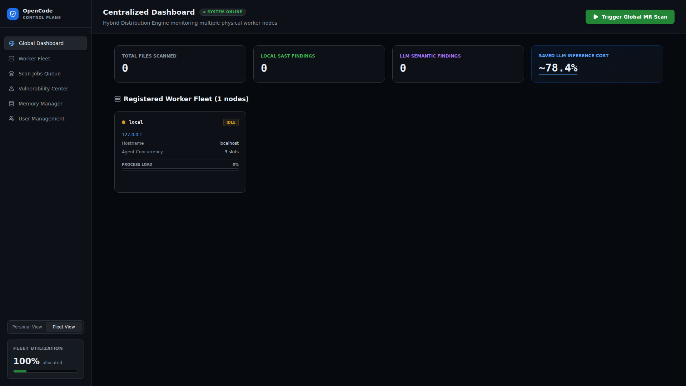
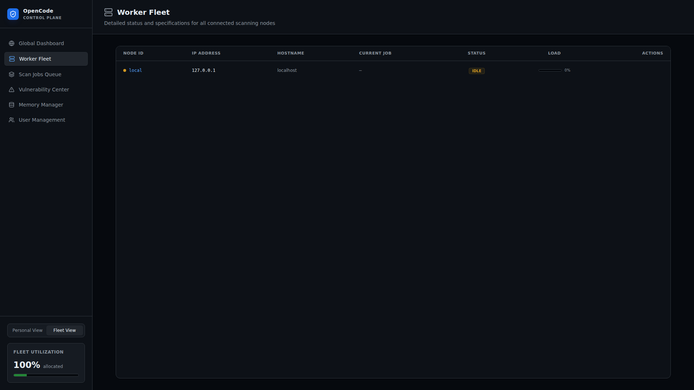
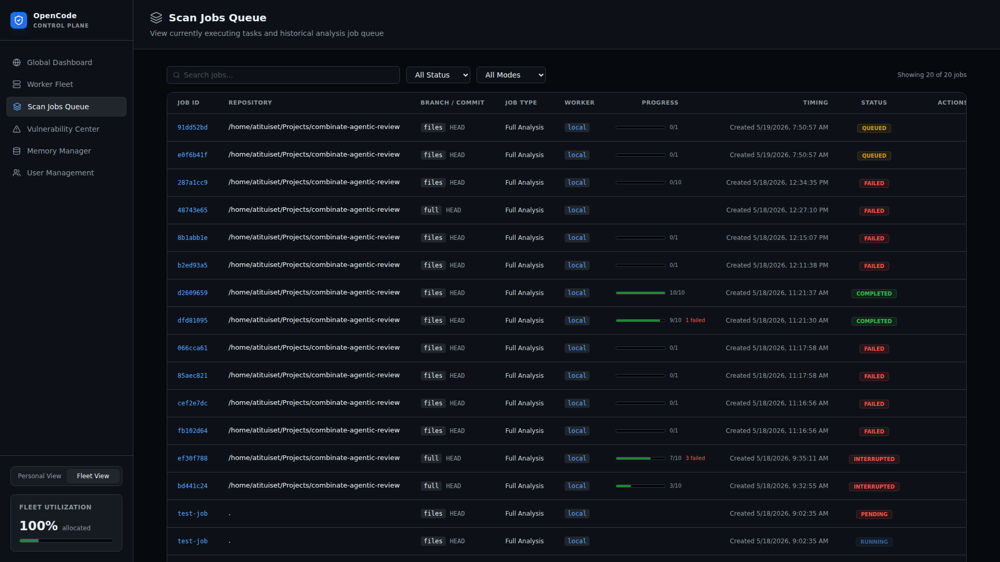
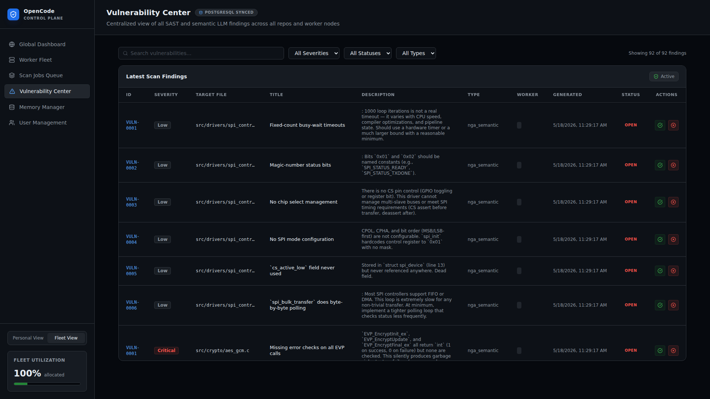
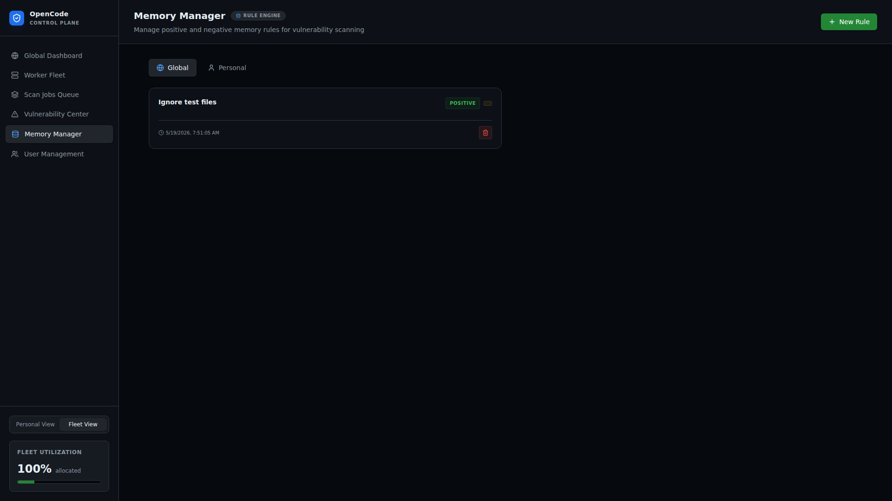
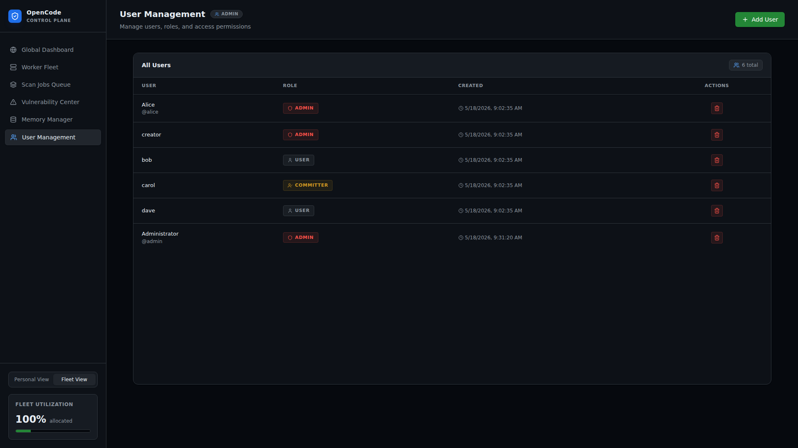
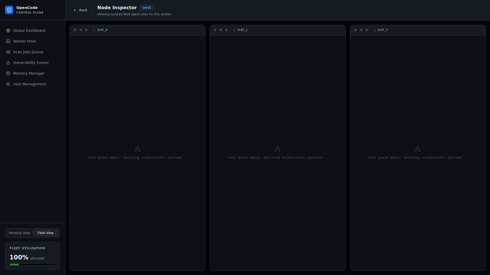

# 前端概览与组件

## 技术栈

- **构建工具**: Vite
- **框架**: React 19 + TypeScript
- **样式**: Tailwind CSS
- **状态**: React Context + hooks

## 项目结构

```
frontend/src/
├── main.tsx                    # 入口，渲染 App + AuthProvider
├── App.tsx                     # 应用壳，视图路由 + SSE 管理
├── context/
│   └── AuthContext.tsx         # 认证上下文，Token 管理
├── hooks/
│   └── useApi.ts              # API 客户端，所有后端调用
└── components/
    ├── LoginPage.tsx           # 登录页
    ├── DashboardMain.tsx       # 管理员全局仪表盘
    ├── PersonalDashboard.tsx   # 用户个人视图
    ├── ScanJobsQueue.tsx       # 扫描作业队列
    ├── VulnerabilityCenter.tsx # 漏洞中心
    ├── ReportViewer.tsx        # 报告查看器
    ├── WorkerFleet.tsx         # Worker 集群
    ├── NodeDetail.tsx          # 节点详情 + 终端日志
    ├── MemoryManager.tsx       # Memory Rule 管理
    └── UserManager.tsx         # 用户管理
```

## 页面截图与说明

### 登录页面 (LoginPage)


- 用户名/密码表单
- JWT 认证
- 默认凭据提示: admin / admin123

### 全局仪表盘 (DashboardMain)



管理员专属的全局视图，包含：

- **Fleet Utilization** — 集群利用率指标
- **Trigger Global MR Scan** — 触发全量扫描按钮
- **统计卡片** — Total Files Scanned / Local SAST Findings / LLM Semantic Findings / Saved LLM Inference Cost
- **Registered Worker Fleet** — 已注册 Worker 节点卡片
- **Personal View / Fleet View** 切换

### Worker 集群 (WorkerFleet)



展示所有注册的 Worker 节点，每个节点卡片显示：

- Worker ID / 状态 (idle/busy)
- IP 地址 / 主机名
- Agent 并发槽位数
- 进程负载百分比

### 扫描作业队列 (ScanJobsQueue)



作业管理界面：

- 作业列表（支持过滤/搜索）
- 作业状态标签 (pending/running/completed/failed/cancelled)
- Cancel / Resume 操作按钮

### 漏洞中心 (VulnerabilityCenter)



漏洞生命周期管理：

- 严重程度/状态/类型 筛选器
- Accept / Reject / Assign 操作
- 漏洞详情展示

### Memory Rule 管理 (MemoryManager)



知识库管理：

- **Global** / **Personal** 选项卡
- 正向（聚焦） / 负向（忽略）规则
- 审批工作流 (pending → approved/rejected)

### 用户管理 (UserManager)



Admin 专属功能：

- 用户列表
- 创建/删除用户
- 角色分配 (admin/committer/user)

### 节点详情 (NodeDetail)



Worker 节点的终端视图：

- 每个槽位的实时日志流（ANSI 渲染）
- Slot 状态指示
- 实时 SSE 连接
