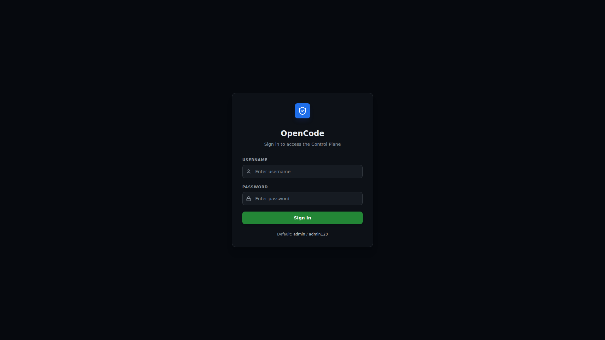

# 快速开始

## 前置条件

- Python 3.12+
- Node.js 22+
- Redis 7+
- `nga` CLI (OpenCode Agent)

## 本地开发

### 1. 启动 Redis

```bash
redis-server --daemonize yes
```

### 2. 安装后端依赖

```bash
pip install -r requirements.txt
```

### 3. 构建前端

```bash
cd frontend
npm install
npm run build
cd ..
```

### 4. 启动应用

```bash
PYTHONPATH=. uvicorn backend.main:app --host 0.0.0.0 --port 8000
```

应用启动后：

- 自动创建数据库表并 seed 默认管理员账户
- 启动调度器（APScheduler）
- 启动本地 Worker 循环（Redis BRPOP 消费者）
- 在 `http://localhost:8000` 提供前端静态文件服务

### 5. 登录

访问 `http://localhost:8000`，使用默认凭据：

| 用户名 | 密码 |
|--------|------|
| admin | admin123 |



## Docker 部署

```bash
docker compose up --build
```

详见 [Docker 部署](./deployment/docker.md) 章节。

## 独立 Worker 节点

在远程机器上运行：

```bash
python3 worker_node.py
```

Worker 会自动向 Gateway API 注册，通过 Redis 消费作业，并定期发送心跳。
